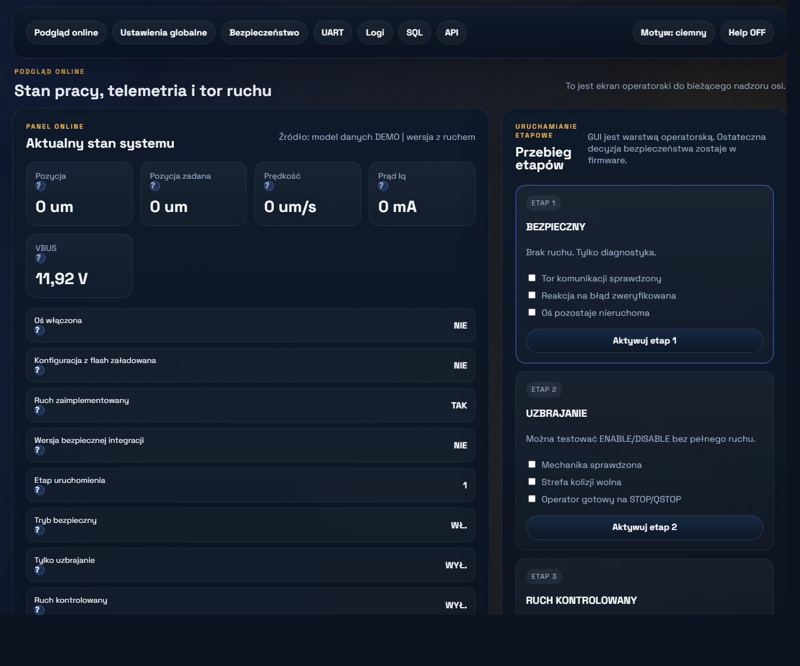
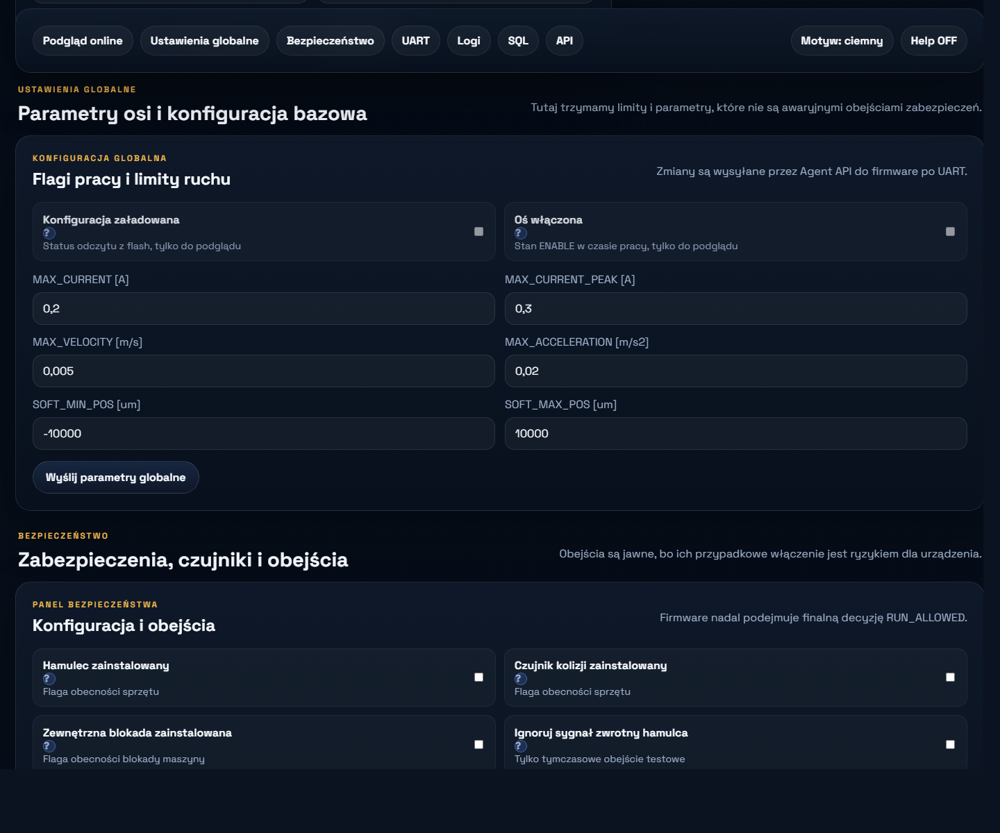
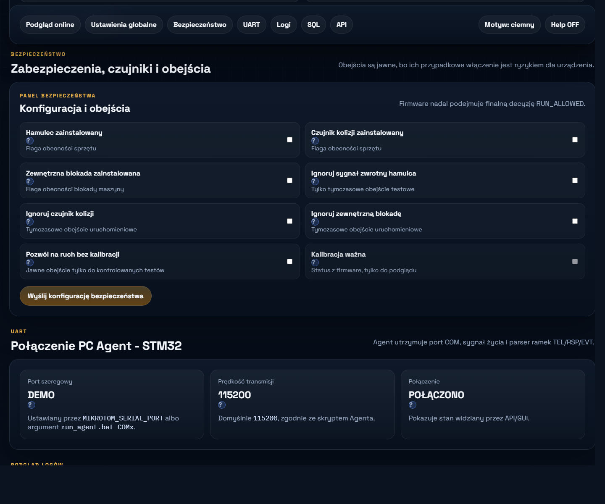
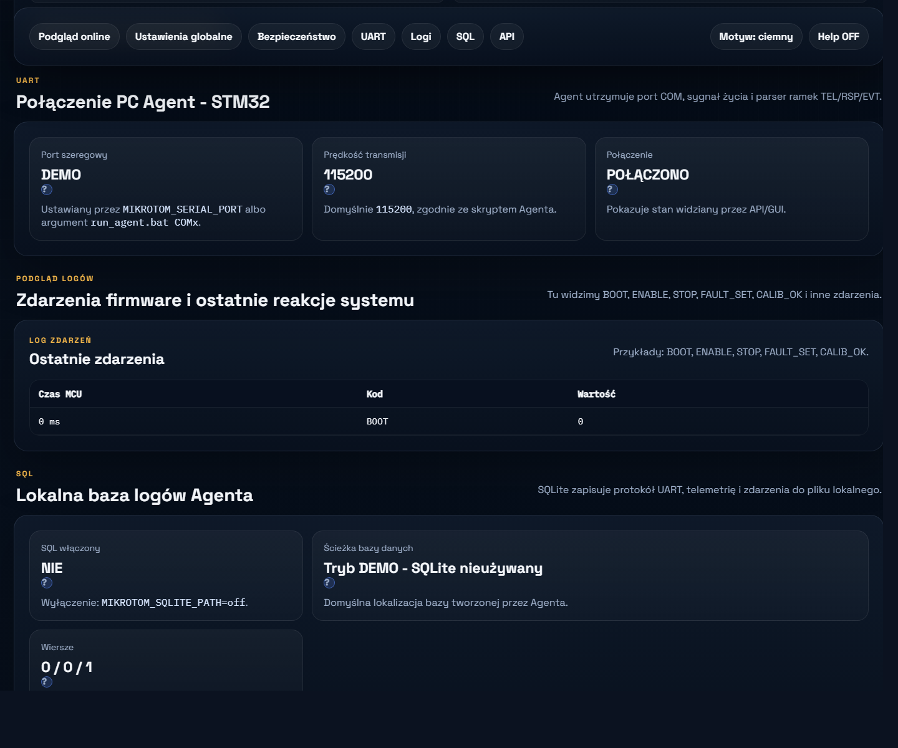
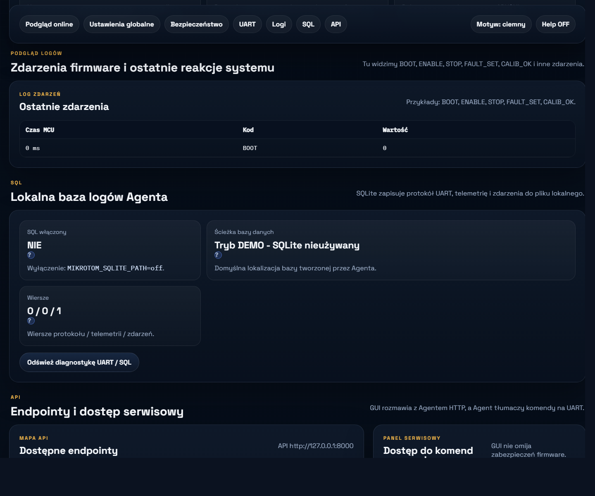
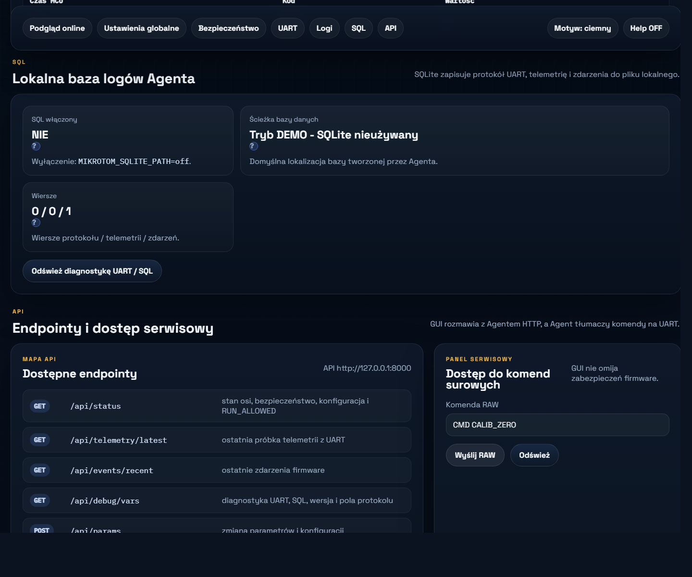
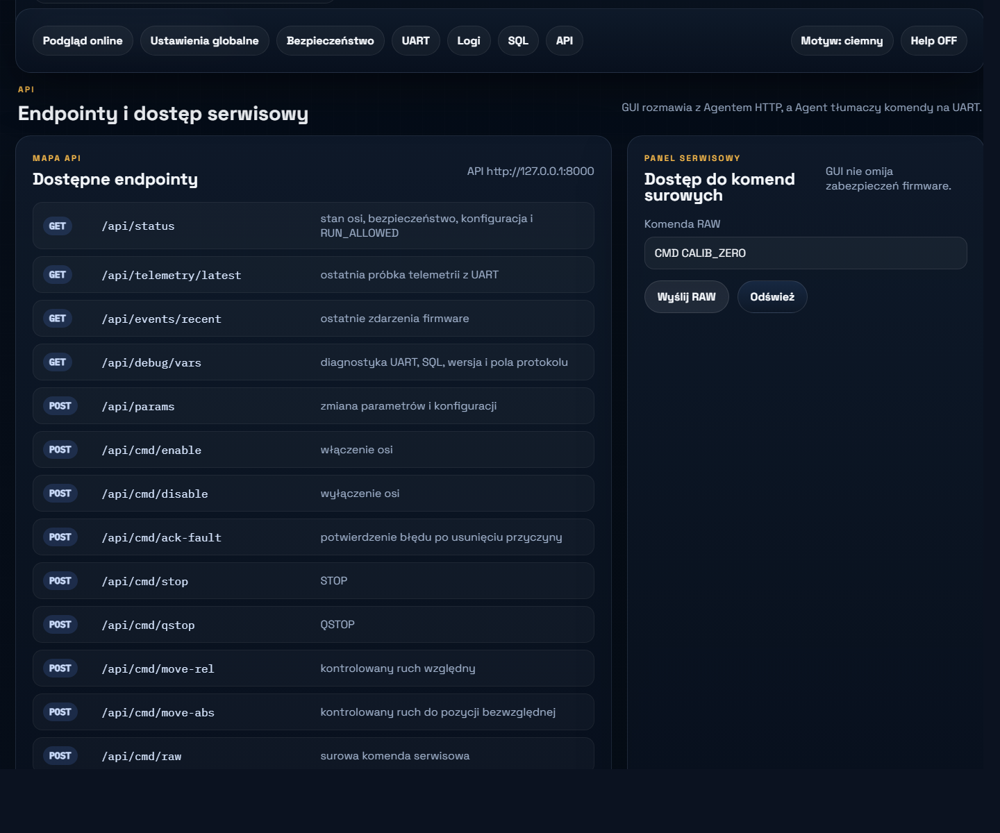

# Wariant B - instrukcja użytkownika GUI

Ta instrukcja opisuje sposób pracy z aplikacją operatorską `GUI` w projekcie Mikrotom.

Zrzuty poniżej pokazują aktualny interfejs. Układ ekranów w trybie `LIVE` jest taki sam jak w trybie `DEMO`; zmieniają się tylko dane pobierane z Agenta i STM32.

## 1. Dlaczego to narzędzie powstało

Stary software sterownika skupiał się głównie na warstwie napędowej i sprzętowej.

Nowe GUI powstało po to, aby operator i integrator mieli w jednym miejscu:

- podgląd stanu systemu,
- commissioning etapowy,
- konfigurację parametrów,
- konfigurację safety,
- diagnostykę UART,
- logi,
- SQL,
- mapę API,
- panel serwisowy.

GUI jest więc narzędziem operatorsko-diagnostycznym, a nie samodzielnym sterownikiem mocy.

## 2. Co GUI robi, a czego nie robi

GUI robi:

- pokazuje statusy firmware,
- wysyła komendy do Agenta,
- pozwala ustawiać parametry,
- wspiera commissioning,
- ułatwia diagnostykę.

GUI nie robi:

- nie steruje sprzętem bezpośrednio,
- nie omija safety,
- nie zastępuje decyzji firmware,
- nie daje prawa do ruchu tylko dlatego, że przycisk jest widoczny.

Prawidłowy przepływ to:

```text
GUI -> HTTP API -> Agent -> UART -> STM32
```

## 3. Górna belka

Na górnej belce znajdują się:

- zakładki aplikacji,
- przełącznik motywu `ciemny/jasny`,
- przełącznik `Help ON/OFF`.

### Help ON

Po włączeniu:

- pojawiają się ikony `?`,
- po najechaniu widać opis znaczenia elementu,
- na końcu opisu widoczna jest referencja do zmiennej, funkcji albo endpointu.

### Help OFF

Po wyłączeniu:

- ikonki `?` znikają,
- dymki nie są pokazywane,
- interfejs staje się prostszy dla zwykłej pracy operatorskiej.

## 4. Podgląd online



Zakładka `Podgląd online` jest głównym ekranem pracy.

Znajdziesz tu:

- status połączenia z Agentem,
- stan osi,
- fault,
- `RUN_ALLOWED`,
- etap uruchomienia,
- KPI: pozycja, pozycja zadana, prędkość, prąd Iq, VBUS,
- statusy safety,
- commissioning etapowy.

### Jak czytać ten ekran

- `Połączenie OK` oznacza, że GUI ma kontakt ze źródłem danych,
- `FAULT` pokazuje aktywny błąd firmware,
- `RUN_ALLOWED` jest centralną zgodą firmware na ruch,
- `VBUS` pokazuje napięcie magistrali zasilania,
- statusy takie jak `Tryb bezpieczny`, `Kalibracja ważna` i `Ruch kontrolowany` pokazują logikę po stronie STM32.

### Co jest ważne na pierwszym uruchomieniu

W aktualnym buildzie `safe integration` poprawny wynik to zwykle:

- brak samoczynnego ruchu,
- działająca komunikacja,
- logicznie spójny status,
- `RUN_ALLOWED = 0`.

## 5. Commissioning etapowy - jak używać panelu etapów

Przebieg etapów w GUI nie służy do „kliknięcia ruchu”, tylko do wymuszenia bezpiecznej kolejności uruchomienia.

### Etap 1

Znaczenie:

- komunikacja,
- diagnostyka,
- brak ruchu.

Co powinno być fizycznie podłączone:

- USB-UART,
- logiczne zasilanie sterownika,
- ST-LINK do flashowania według potrzeby,
- tor mocy najlepiej wyłączony lub ograniczony.

Co robi operator:

- sprawdza połączenie,
- sprawdza brak faultów lub ich czytelny opis,
- sprawdza, czy oś nie rusza,
- sprawdza `VBUS`, `UART`, `Logi`, `SQL`.

### Etap 2

Znaczenie:

- uzbrajanie,
- test logiki,
- brak pełnego ruchu.

Co powinno być fizycznie podłączone:

- USB-UART,
- logika aktywna,
- mechanika przygotowana do testów,
- operator gotowy do `STOP` i `QSTOP`.

Co robi operator:

- testuje `ENABLE`,
- testuje `DISABLE`,
- testuje `STOP`,
- testuje `QSTOP`,
- obserwuje `Logi` i `UART`.

### Etap 3

Znaczenie docelowe:

- przygotowanie do ruchu kontrolowanego.

Bardzo ważne:

W aktualnym pakiecie `safe integration` etap 3:

- nie oznacza jeszcze gotowości do realnego ruchu,
- służy tylko do walidacji przepływu GUI i logiki commissioning,
- nie powinien być traktowany jako produkcyjny test osi.

### Jak korzystać z checklist

Checkboxy przy etapach są potwierdzeniem operatora:

- nie wykonują pomiaru same z siebie,
- nie zastępują oględzin urządzenia,
- nie zastępują kontroli mechaniki,
- nie są automatycznym systemem bezpieczeństwa.

Najpierw wykonujesz kontrolę fizyczną, dopiero potem zaznaczasz checklistę.

## 6. Przyciski operatorskie

W `Podglądzie online` znajdziesz zwykle:

- `ENABLE`,
- `DISABLE`,
- `ACK FAULT`,
- `STOP`,
- `QSTOP`,
- ruch względny,
- ruch bezwzględny,
- `CALIB_ZERO`.

### Jak je rozumieć

- `STOP` to normalne zatrzymanie,
- `QSTOP` to szybsze zatrzymanie i przejście w bezpieczniejszy stan,
- `ACK FAULT` wolno użyć dopiero po usunięciu przyczyny błędu,
- komendy ruchu są nadal filtrowane przez firmware.

W obecnym buildzie przyciski ruchu nie powinny uruchomić realnego ruchu osi.

## 7. Ustawienia globalne



Zakładka `Ustawienia globalne` służy do ustawienia podstawowych limitów pracy osi.

Najważniejsze pola:

- `MAX_CURRENT [A]`,
- `MAX_CURRENT_PEAK [A]`,
- `MAX_VELOCITY [m/s]`,
- `MAX_ACCELERATION [m/s2]`,
- `SOFT_MIN_POS [um]`,
- `SOFT_MAX_POS [um]`.

### Jak używać

1. Ustaw konserwatywne limity.
2. Wyślij parametry.
3. Wróć do `Podgląd online`.
4. Sprawdź, czy statusy są spójne.

Na pierwsze uruchomienie wartości powinny być zachowawcze.

## 8. Bezpieczeństwo



Zakładka `Bezpieczeństwo` oddziela konfigurację safety od zwykłych limitów pracy.

Ustawiasz tu:

- obecność hamulca,
- obecność czujnika kolizji,
- obecność zewnętrznej blokady,
- ignorowanie sygnałów safety,
- zgodę na ruch bez kalibracji,
- status kalibracji.

### Jak używać

- pola `zainstalowany` opisują rzeczywisty hardware,
- pola `ignoruj` i `pozwól` są obejściami,
- obejścia powinny być używane tylko świadomie i tymczasowo.

Jeżeli nie masz wyraźnej potrzeby testowej:

- nie używaj override,
- zostaw obejścia wyłączone.

## 9. UART



Zakładka `UART` pokazuje stan kanału komunikacyjnego między Agentem a STM32.

Widzisz tu:

- port COM,
- baudrate,
- status połączenia,
- dane diagnostyczne z Agenta.

### Kiedy tu zaglądać

- gdy GUI nie ma danych LIVE,
- gdy Agent nie odpowiada,
- gdy są timeouty,
- gdy chcesz potwierdzić poprawny port COM.

## 10. Logi



Zakładka `Logi` pokazuje zdarzenia zgłaszane przez firmware.

Typowe wpisy:

- `BOOT`,
- `ENABLE`,
- `DISABLE`,
- `STOP`,
- `FAULT_SET`,
- `ACK_FAULT`,
- `CALIB_OK`.

### Jak używać logów

- patrz na kolejność zdarzeń,
- porównuj je z tym, co operator zrobił,
- używaj ich do diagnozy sekwencji uruchomienia.

## 11. SQL



Zakładka `SQL` pokazuje lokalne logowanie po stronie Agenta.

Znajdziesz tu:

- informację, czy SQLite działa,
- ścieżkę pliku bazy,
- liczbę zapisanych rekordów.

### Po co to jest

SQL służy do:

- traceability,
- diagnozy po testach,
- porównywania komend i odpowiedzi,
- odkładania telemetrii poza MCU.

## 12. API



Zakładka `API` jest przeznaczona głównie dla integratora i programisty.

Pokazuje:

- endpointy HTTP Agenta,
- ich znaczenie,
- panel komendy `RAW`.

### Panel RAW

To narzędzie serwisowe.

Używaj go do:

- ręcznej diagnostyki,
- pojedynczych komend protokołu,
- testów serwisowych.

Nie używaj go jako zwykłej ścieżki operatorskiej.

## 13. Typowy sposób pracy operatorem

### Szybki start

1. Otwórz `Podgląd online`.
2. Sprawdź `Połączenie`, `FAULT`, `RUN_ALLOWED`, `Etap`.
3. Sprawdź `VBUS`.
4. Potwierdź brak samoczynnego ruchu.

### Ustawienie parametrów

1. Przejdź do `Ustawienia globalne`.
2. Ustaw limity.
3. Wyślij parametry.
4. Wróć do `Podgląd online`.

### Sprawdzenie safety

1. Przejdź do `Bezpieczeństwo`.
2. Potwierdź stany czujników i blokad.
3. Nie włączaj override bez realnej potrzeby.

### Diagnoza problemu

1. `UART` - sprawdź połączenie.
2. `Logi` - sprawdź kolejność zdarzeń.
3. `SQL` - sprawdź, czy logowanie działa.
4. `API` - użyj diagnostyki lub komendy RAW.

## 14. Motyw i pomoc

### Motyw

Przycisk `Motyw: ciemny/jasny` zmienia wygląd interfejsu.

### Help

Przycisk `Help ON/OFF` pozwala przełączać warstwę opisową:

- `ON` - dla uruchomienia, szkolenia i diagnostyki,
- `OFF` - dla prostszej pracy operatorskiej.

## 15. Ograniczenia aktualnej wersji

Aktualna wersja GUI i firmware:

- służy do bezpiecznej integracji,
- nie jest jeszcze końcowym systemem ruchowym,
- nie powinna być traktowana jako gotowa do normalnej produkcyjnej pracy osi.

## 16. Dokumenty powiązane

- `docs/Wariant_B_Instalacja_i_Pierwsze_Uruchomienie.md`
- `docs/STM32_Bringup_Checklist.md`
- `docs/HMI_Protocol.md`
